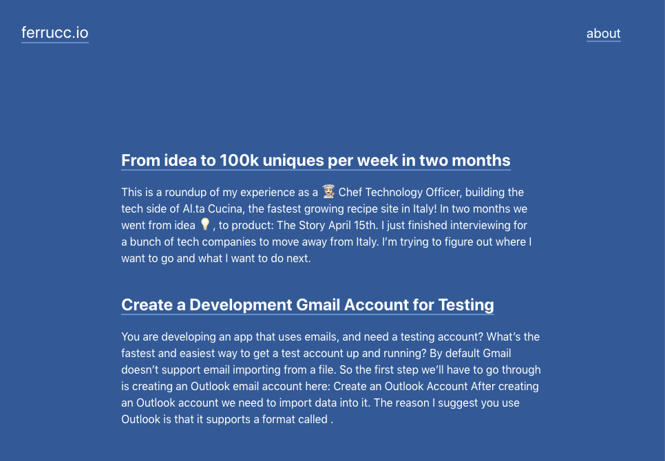

# Ferruccio, my theme for [Hugo](http://gohugo.io/)
## Used for [ferrucc.io](https://ferrucc.io)



[DEMO](https://ferrucc.io/)

[Site Repository](https://github.com/ferrucc-io/ferruccio)

Features

- Responsive
- Accessible
- Custom Robots.txt (changes values based on environment)
- Internal templates for meta data, google analytics, and DISQUS comments
- RSS Discovery
- Table of Contents (must declare `toc: true` in post parameter)

Also includes examples of Hugo Features or Functions:

- Pagination (internal template)
- Taxonomies
- Archetypes
- Custom shortcode
- Related content
- Hugo built-in menu
- `with`
- `HUGO_ENV`
- `first`
- `after`
- `sort`
- Site LanguageCode
- `where`
- Content Views
- Partials
- Template layouts (type "post" uses a special list template, single template,  and a content view)
- Tags
- `len`
- Conditionals
- `ge` (greater than or equal to)
- `.Site.Params.mainSections` to avoid hard-coding "blog," etc. [[release note](https://github.com/spf13/hugo/blob/66ec6305f6cb450ddf9c489854146bac02f7dca1/docs/content/meta/release-notes.md#enhancements)]


This theme uses the "Tachyons" CSS library. This will allow you to manipulate the design of the theme by changing class names in HTML without touching the original CSS files. For more information see the [Tachyons website](http://tachyons.io/).


## Installation

Inside the folder of your Hugo site run:

    $ cd themes
    $ git clone https://github.com/ferrucc-io/hugo-theme.git

For more information read the official [setup guide](//gohugo.io/overview/installing/) of Hugo.


## Getting started

After installing the theme successfully it requires a just a few more steps to get your site running.


### The config file

Take a look inside my [`blog's`](https://github.com/ferrucc-io/ferruccio) repository. You'll find a file called [`config.toml`](https://github.com/ferrucc-io/ferruccio/blob/master/config.toml). To use it, copy the [`config.toml`](https://github.com/ferrucc-io/ferruccio/blob/master/config.toml) in the root folder of your Hugo site. Feel free to change the strings in this theme.


### Change the hero background

For any page or post you can add a featured image by including the local path in front matter (see content in the ExampleSite folder for examples): `featured_image: '/images/gohugo-default-sample-hero-image.jpg'`

You don't need an image though. The default background color is black, but you can change the color, by changing the default color class in the config.toml file. Choose a background color from any on the [Tachyons](http://tachyons.io/docs/themes/skins/) library site, and preface it with "bg-"

example: `background_color_class = "bg-blue"` or `background_color_class = "bg-gray"`


### Custom CSS

You can override the built-in css by using your own. Just put your own css files in the `static` directory of your website (the one in the theme directory also works but is not recommended) and modify the `custom_css` parameter in your config file. The path referenced in the parameter should be relative to the `static` folder. These css files will be added through the `header` partial after the built-in css file.

For example, if your css files are `static/css/custom.css` and `static/css/custom2.css` then add the following to the config file:

```
    [params]
      custom_css = ["css/custom.css","css/custom2.css"]
```

### Nearly finished

In order to see your site in action, run Hugo's built-in local server.

`$ hugo server`

Now enter [`localhost:1313`](http://localhost:1313/) in the address bar of your browser.

## Production

To run in production (e.g. to have Google Analytics show up), run `HUGO_ENV=production` before your build command. For example:

```
HUGO_ENV=production hugo
```

## Contributing

If you find a bug or have an idea for a feature, feel free to use the [issue tracker](https://github.com/ferrucc-io/hugo-theme/issues) to let me know.